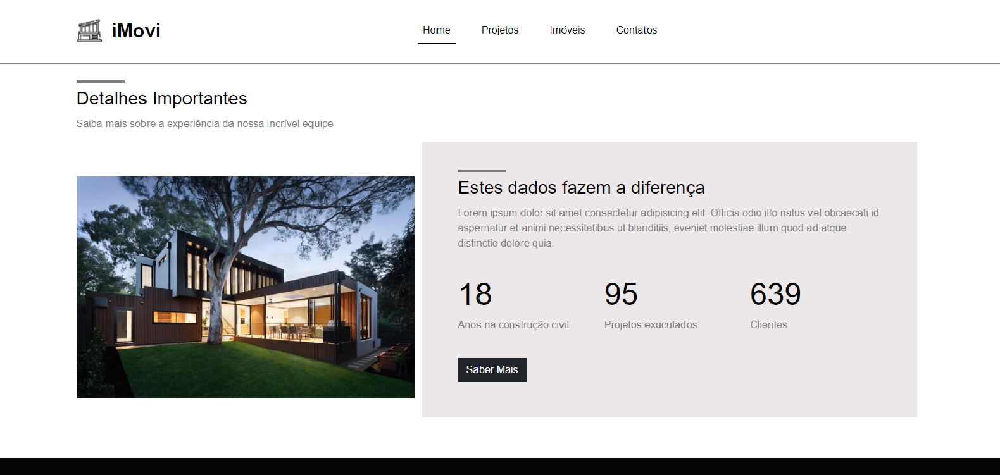

# App iMovi

## Sobre o iMovi
<p>
  É um site desenvolvido, durante um curso de Bootstrap 5, por Matheus Battisti do canal <strong>Hora de Codar</strong>. Envolvendo componentes do Bootstrap como card e carousel. 
</p>
<p>
  O site tem por finalidade demonstrar a homepage de um site que simula uma empresa que negocia imóveis, demonstrando, através de alguns componentes do Bootstrap, serviços e imagens
  de imóveis prontos.
</p>

## Layout web





## Layou mobile

<div>
  
  
  
  
  
</div>

## Tecnologias utilizadas
<p>Linguagens e padrões que foram utilizados para desenvolver o app</p>

## Front-end
- HTML
- CSS
- JavaScript
- Bootstrap 5

### Competências 
- Layout responsivo 
- Componentes do Bootstrap 5

## Como executar o projeto

Instruções para executar o app

## Front-end
Pré-requisitos: Navegador

Clonar repositório

```bash
  https://github.com/othonss/Projeto-iMovi
```
Editar com IDE ou Editor de preferência

Acessar utilizando navegador de preferência

## Autor 

Othon Santos da Silva

<a href="https://www.linkedin.com/in/othon-santos-35531b129/" target="_blank">
    
 </a>
